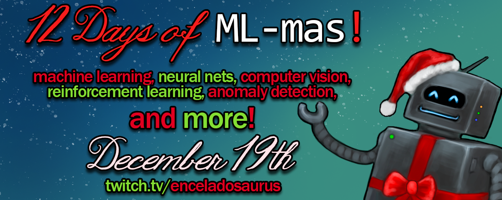

# Celebrating the 12 Days of Machine Learning-mas

## A tutorial-based streamathon covering the basics of machine learning
### About
The 12 days of Machine Learning-mas are beginner-friendly tutorials on the basics of machine learning. The tutorials will be streamed on [Twitch](https://www.twitch.tv/enceladosaurus), and the vods will be posted on YouTube (exact location TBD). The code will be posted here following each lesson, and more detailed notes with deeper dives into the math and concepts will be posted following the event. 

### Schedule
- Dec. 19th: Linear Regression
- Dec. 20th: Logistic Regression
- Dec. 21st: Classification
- Dec. 27th: Ensembling - Random Forest
- Dec. 28th: K-Means
- Dec. 29th: Anomaly Detection
- Dec. 30th: Intro to Reinforcement Learning
- Jan. 2nd: Neural Nets 101
- Jan. 4th: Advanced Reinforcement Learning
- Jan. 6th: Network Analysis
- Jan. 7th: Natural Language Processing
- Jan. 8th: Computer Vision

### Details
Each tutorial will cover a specific topic or model in machine learning, and the code will be written in Python. Simpler models will be built in Jupyter Notebooks for ease of explanation and visualization, but later models will be script-only. 

The code from each stream can be found in the `notebooks` folder and the blackboard notes in the `blackboard` folder. Detailed lecture notes, including math, relevant links, and whatnot will be added after the event has finished.
For more information or if you have questions, please join the [Discord](https://discord.gg/4QUDdWn) or reach out on [Twitter](https://twitter.com/Enceladosaurus). 
